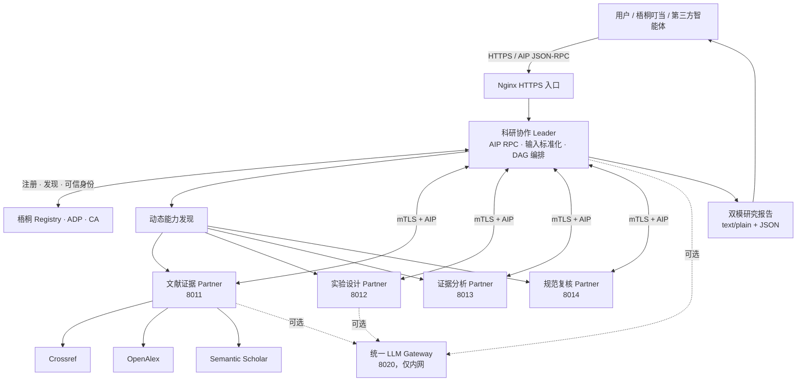
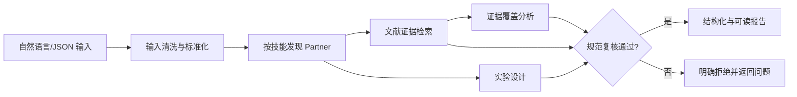
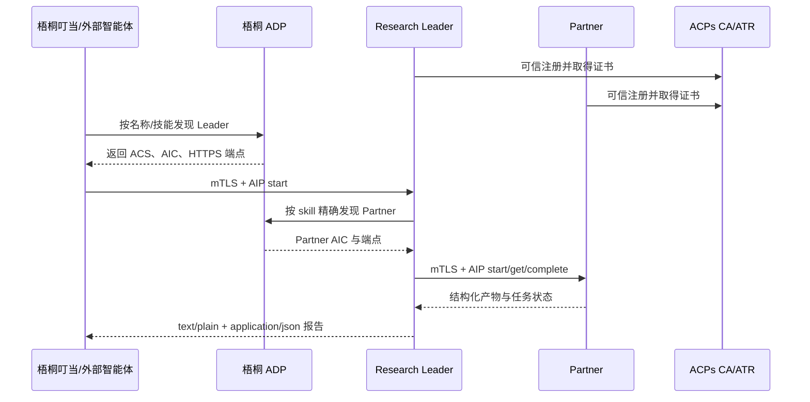
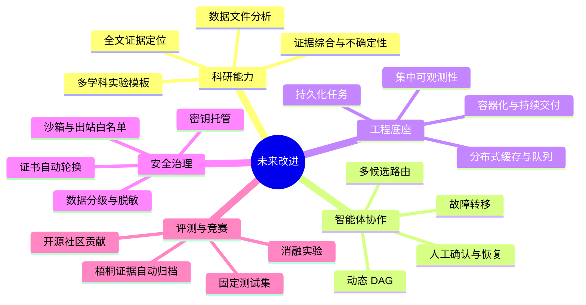

# “智能体互联”赛道技术报告

## 作品基本信息

| 项目 | 内容 |
| --- | --- |
| 参赛作品名称 | **研联智协：多智能体科研助理** |
| 项目完整名称 | 基于多智能体协作的一站式科研助理平台 |
| 作品版本 | 0.7.0（梧桐已验证基线为 0.6.0） |
| 参赛赛道 | 全球校园人工智能算法精英大赛——智能体互联赛道 |
| 互联模式 | AIP Direct RPC，HTTPS/mTLS 直连 |
| 核心组成 | 1 个 Leader、4 个 Partner、1 个统一 LLM Gateway |
| 开源仓库 | [Nya-Poka/AIC_multiagentic](https://github.com/Nya-Poka/AIC_multiagentic) |

> 匿名提交说明：正式提交版本不应出现团队、学校、指导教师、联系方式或校徽等身份信息。本报告因此仅保留作品与技术信息。作品名称控制在 20 个汉字以内；项目完整名称用于正文说明。

## 作品简介（300 字以内）

科研工作常同时涉及文献检索、实验设计、证据分析和方法复核，单一智能体容易产生来源不可追溯、方案不可复现和结果缺少复核等问题。本项目基于 AIP 互联标准构建一套一站式多智能体科研助理：Leader 将自然语言或非标准 JSON 转换为统一研究请求，通过梧桐平台发现并调度文献、实验、分析和复核 Partner，最终生成包含真实文献元数据、结构化实验协议、质量检查和完整调用轨迹的科研报告。系统已完成梧桐注册、发现、跨端调用、AIC 身份绑定和 mTLS 双向认证验证，可用于科研选题论证、方案预审和教学演示，但不替代伦理审批或高风险研究决策。

---

## 摘要

本项目面向科研流程碎片化、单智能体结论难复核、异构能力难组合等问题，设计并实现了基于 AIP 的多智能体科研协作平台。系统由科研协作 Leader、文献证据 Partner、实验设计 Partner、证据分析 Partner、规范复核 Partner 和统一 LLM Gateway 组成。Leader 同时支持自然语言、严格 JSON、宽松 JSON 和 Markdown 内嵌 JSON，先完成输入结构化，再按任务依赖动态发现和调用能力：文献检索与实验设计并行执行，证据分析依赖文献结果，规范复核作为最终硬门禁。

项目使用官方 `acps-sdk 2.2.0` 的 AIP 数据模型、任务状态机与 JSON-RPC 客户端，按照 ACS v02.02 描述智能体，通过 ATR/ACME 为运行实体签发独立的 `clientAuth`/`serverAuth` 证书，并以 mTLS、AIC 与 `senderId` 绑定实现通信身份校验。v0.6.0 的 Leader 与四个 Partner 已完成平台验证；v0.7.0 新增 Dataset 与 Synthesis Partner，在取得正式 AIC 和证书前于平台模式默认关闭。

在科研能力上，文献 Partner 并行访问 Crossref、OpenAlex 和 Semantic Scholar，结合意图拆解、RRF 融合、概念覆盖、主题直接性、元数据质量分级和语义去重，保留 DOI、来源、开放获取地址及过滤原因；可选开放全文模块执行 SSRF 防护、流式大小限制和片段哈希；实验 Partner 输出可校验的完整研究协议；Dataset Partner 对哈希校验后的 CSV、JSON、XLSX 执行确定性统计；Synthesis Partner 生成证据矩阵与不确定性提示；复核 Partner 执行硬门禁。系统在本地自动化测试中已通过 51 项测试，并已在梧桐环境完成 v0.6.0 智能体发现、外部调用 Leader、Leader 调用四个 Partner 的全链路验证。

**关键词：** AIP；智能体互联；多智能体协作；梧桐平台；可信注册；mTLS；科研助理；证据检索；可复现实验

---

# 一、项目背景

## 1.1 行业与技术背景

大模型能够快速生成科研文本，但科研任务并不是一次问答。一个可交付的研究方案通常需要至少完成以下环节：检索可核验的外部证据、界定研究问题、设计研究协议、评估数据与证据质量、检查统计计划和伦理边界。若所有能力都封装在一个大模型提示词中，会出现三类问题：

1. **能力封闭。** 不同平台、框架和组织实现的智能体缺少统一发现和调用方式，专业能力难以复用。
2. **结果不可追溯。** 模型可能生成貌似合理但无法通过 DOI 或公开元数据核验的引用，调用过程也缺少统一任务标识和状态记录。
3. **流程不可审查。** 文献、实验和分析互相依赖，单次生成无法证明执行顺序、责任边界和失败处理是否正确。

AIP 为异构智能体提供统一的能力描述、任务交互和状态语义；梧桐平台则提供注册、发现和跨端验证环境。本项目不把“多智能体”理解为同一进程中的多个提示词，而是将每个科研角色实现为具有独立 AIC、ACS、网络端点、任务存储和 TLS 身份的服务，通过标准协议形成真实协作闭环。

## 1.2 项目目标与定位

项目定位为“科研前期与方案阶段的一站式协作助理”，目标包括：

- 基于官方 ACPs 开源实现接入 AIP，而非自定义一套仅在本项目内可用的调用协议；
- 在梧桐完成注册、审核、发现和实际调用验证；
- 将自然语言研究问题转化为机器可处理的标准结构；
- 根据技能动态发现文献、实验、分析和复核智能体；
- 生成真实、可核验、可追溯的文献证据，而非生成式“引用”；
- 形成具有变量定义、样本量、分析、复现和伦理条目的研究协议；
- 记录每次协作的 AIC、技能、端点、任务 ID、最终状态和耗时；
- 在网络、模型或证据质量不足时明确失败或降级，不把不完整结果伪装成成功。

项目不替代人工阅读全文、同行评议、伦理委员会审批、临床/高风险实验决策，也不承诺文献元数据质量等于论文研究质量。

## 1.3 赛题契合度

项目与赛题关注点的对应关系如下：

| 赛题关注点 | 项目实现 |
| --- | --- |
| 异构协议适配 | 使用官方 AIP JSON-RPC、ACS v02.02 和统一任务状态；LLM 通过独立 OpenAI-compatible Gateway 解耦供应商 |
| 多智能体协作与调度 | 1 Leader + 4 Partner；并行、串行依赖和最终质量门禁组成 DAG |
| 交互安全 | ATR/ACME 证书、mTLS、AIC/证书/`senderId` 三方身份绑定、平台模式 fail-closed |
| 垂直场景创新 | 面向真实科研工作流，覆盖证据、实验、分析、复核和可追溯报告 |
| 梧桐环境验证 | 已完成 Leader 可发现、外部 AIP 调用和四 Partner 实际协作验证 |

---

# 二、需求分析

## 2.1 用户与行业痛点

| 用户/角色 | 核心问题 | 系统回应 |
| --- | --- | --- |
| 学生与初级研究者 | 不清楚如何把问题转成可复现方案 | 结构化输入、实验协议模板、硬性方法复核 |
| 研究人员 | 文献检索来源分散、去重困难 | 三源并行检索、RRF 融合、DOI/标题语义去重 |
| 课题负责人 | 结果缺少过程证据，难以审查 | provenance 轨迹、被过滤记录、质量门禁结果 |
| 科研教学人员 | 缺少可演示的多角色科研流程 | 可视化 Web 工作台与完整 AIP 协作闭环 |
| 平台开发者 | 异构智能体难发现、难安全互调 | ACS 技能声明、ADP 动态发现、mTLS 身份验证 |

## 2.2 功能需求

1. **多形态输入。** 接收自然语言、标准/宽松 JSON、Markdown 代码块和平台包装文本。
2. **输入标准化。** 统一生成 `question`、`objective`、`literature_query`、`max_literature_results`、`documents`、`constraints`。
3. **动态能力发现。** 本地开发使用能力注册表；平台运行使用梧桐 ADP，严格按技能匹配。
4. **文献证据检索。** 从多个公开学术源检索真实元数据，完成排序、去重、质量评级和审计。
5. **实验方案生成。** 输出可通过 schema 验证的实验设计、变量、样本量、统计计划、复现和伦理要求。
6. **证据分析。** 计算来源、DOI、摘要、开放获取、年代、相关性和去重等覆盖指标。
7. **规范复核。** 对无关证据、低质量来源、占位变量、不完整功效分析或统计计划进行拒绝。
8. **双模输出。** 同时输出面向人类的 `text/plain` 和面向程序的 `application/json`。
9. **过程追溯。** 保存协作任务的身份、技能、端点、任务 ID、状态和时延。

## 2.3 非功能需求

| 类别 | 要求 | 实现方式 |
| --- | --- | --- |
| 标准兼容 | 遵循 AIP 和官方 SDK | `acps-sdk 2.2.0`、ACS v02.02、AIP Task 模型 |
| 安全性 | 禁止匿名智能体伪造身份 | 双向 TLS、证书 AIC 与消息 `senderId` 绑定 |
| 可用性 | 单一文献源故障不使全流程失效 | 多源并行、独立超时、种子文献回退 |
| 一致性 | 不接受串线任务或错误 Partner 响应 | 校验 `taskId`、`sessionId`、Partner `senderId` |
| 可解释性 | 结果能够追溯到来源和执行步骤 | DOI、source、query、过滤原因、provenance |
| 可测试性 | 关键路径可自动回归 | 单元测试、内存 HTTP 集成、跨进程 smoke test |
| 隐私 | API Key 不进入浏览器或报告 | Key 仅存在服务端 Gateway 环境变量 |
| 伦理 | 不自动批准高风险研究 | 强制 `requires_human_approval=true` 与伦理条目 |

## 2.4 验收指标与统计口径

以下指标用于正式提交前统一采集，未完成实测的指标不得填写推测值：

| 指标 | 计算口径 | 当前状态 |
| --- | --- | --- |
| 智能体注册成功率 | 审核通过且 ACS 可读取的智能体数 / 提交数 | Leader 与四 Partner 已注册；提交前重新截图确认 |
| 平台发现成功率 | 预设查询中正确返回目标智能体的次数 / 查询次数 | 已完成功能验证；待固定测试集复测 |
| 全链路协作成功率 | `completed` 且 Review 通过的请求数 / 有效请求数 | 待批量实测 |
| Partner 调用成功率 | 最终状态为 `completed` 的 Partner 调用数 / 总调用数 | 单次全链路验证为 4/4；待批量实测 |
| 端到端时延 | 从 Leader 接受请求到报告完成的 P50/P95 | 系统已逐调用记录 `duration_ms`；待导出统计 |
| 文献相关证据比例 | 通过相关性与直接性门禁的记录 / 唯一候选记录 | 已实现统计；待固定数据集实测 |
| DOI/摘要覆盖率 | 含 DOI/摘要的最终证据数 / 最终证据数 | 已实现统计；待固定数据集实测 |
| 自动化测试通过率 | 通过测试数 / 测试总数 | **51/51（当前本地版本）** |

---

# 三、互联技术路线与总体方案

## 3.1 技术选型

| 层次 | 技术 |
| --- | --- |
| 协议与 SDK | AIP、`acps-sdk 2.2.0`、JSON-RPC |
| 服务框架 | Python、FastAPI、Uvicorn、Pydantic |
| 能力发现 | 本地 Capability Registry / 梧桐 ADP |
| 可信身份 | ACS v02.02、ATR/ACME、AIC、X.509、mTLS |
| 文献数据 | Crossref、OpenAlex、Semantic Scholar |
| 模型接入 | 独立 OpenAI-compatible LLM Gateway；当前可连接 DeepSeek |
| 可观测性 | provenance、AMP access/heartbeat NDJSON、systemd journal |
| 部署 | Ubuntu、systemd、Nginx、HTTPS、云主机 |
| 测试 | pytest、httpx、内存 ASGI、独立进程 smoke test |

## 3.2 分层架构



系统共六个独立服务，Partner 具有独立端口、AIC、ACS、证书和任务存储。LLM Gateway 不属于对外互联智能体，只承担模型供应商适配与密钥隔离。

## 3.3 智能体角色与能力

| 角色 | 技能 ID | 端口 | 核心职责 |
| --- | --- | ---: | --- |
| Leader | `research-collaboration.orchestration` | 8000 | 输入标准化、发现、DAG 调度、质量门禁、报告汇总 |
| Literature Partner | `literature-search` | 8011 | 多源检索、重排、去重、来源评级与证据审计 |
| Experiment Partner | `experiment-design` | 8012 | 结构化、可复现、带伦理边界的实验协议 |
| Analysis Partner | `data-analysis` | 8013 | 确定性的证据覆盖与质量统计 |
| Review Partner | `method-review` | 8014 | 方法、证据、复现和伦理硬性复核 |
| LLM Gateway | 非 AIP 智能体 | 8020 | 模型供应商适配、密钥隔离、输出约束和用量记录 |

## 3.4 协作 DAG



文献和实验两个任务没有依赖关系，采用 `asyncio.gather` 并行执行；证据分析读取文献产物；复核读取文献、实验和分析产物。该 DAG 同时兼顾执行效率和审查逻辑。

## 3.5 AIP 任务状态闭环

每次 Leader 调用 Partner 都生成唯一 `sessionId` 与 `taskId`，并遵循：

```text
start
  -> accepted / working
  -> awaiting-completion
  -> complete
  -> completed
```

若缺少必要输入，Partner 返回 `awaiting-input`；若轮询超时，Leader 主动 `cancel`；若状态、任务 ID、会话 ID 或发送方 AIC 不一致，则立即拒绝。只有进入 `completed` 且复核通过的请求，才会形成最终报告。

## 3.6 输入结构化模块

Leader 入口并不假设上游一定提供标准 JSON，而是按以下顺序处理：

1. 读取 AIP `StructuredDataItem` 中的对象；
2. 尝试严格 JSON；
3. 解包 `request`、`input`、`payload`、`data` 等常见包装；
4. 从 Markdown 代码块或说明文字中提取 JSON；
5. 修复单引号、尾随逗号、裸键、全角标点和中文字段名；
6. 清除“调用智能体”、DAG 摘要等平台路由噪声；
7. 对普通自然语言执行确定性抽取，配置模型时可由 Gateway 增强；
8. 以 Pydantic 校验为统一 `ResearchRequest`。

LLM 仅帮助提取结构，不负责生成文献或实验数据；模型不可用时自动回退本地解析，不影响 AIP 入口可用性。

## 3.7 文献证据质量流水线

文献 Partner 的设计重点不是“返回更多结果”，而是“返回可核验且与问题直接相关的证据”。流水线如下：

```text
研究问题
 -> 去除平台噪声
 -> 人群/暴露或干预/结局/测量维度拆解
 -> 可选 LLM 英文检索式扩展
 -> 三数据源并行检索（候选池为目标数量的 5 倍）
 -> 规范化与 RRF 多源融合
 -> DOI 去重
 -> 标题 + 年份 + 第一作者的语义去重
 -> 相关性、概念覆盖、主题直接性评分
 -> 元数据质量 A-D 分级
 -> 质量门禁与自动重试
 -> 最终证据 + rejected_records 审计记录
```

系统不以引用次数替代研究质量。质量评级仅依据可验证元数据，例如稳定标识符、题名、作者、年份、摘要、载体、多源一致性和开放获取位置。被过滤记录会保留原因，避免“静默删除”。当直接证据不足时，Review 会拒绝形成确定性结论，而不是用主题相邻文献补足数量。

## 3.8 实验设计与方法门禁

Experiment Partner 输出固定结构，至少包括：设计类型、因果解释边界、研究人群、纳入/排除标准、自变量、因变量、控制条件、混杂因素、干预/暴露、对照、周期、样本量与功效分析、分配、盲法、数据采集、统计分析、缺失数据、复现、伦理、步骤和假设。

Review Partner 会拒绝：

- 含“待定”“视情况”“需具体化”等占位表述的方案；
- 没有量表、设备、单位、评分或时间窗的变量；
- 未说明显著性水平、统计功效、效应量来源和失访的样本量计划；
- 未说明模型、效应估计、置信区间或敏感性分析的统计计划；
- 缺少预注册、版本锁定、原始数据、清洗日志或独立重跑的方案；
- 缺少知情同意、伦理审批和停止规则的方案；
- 低质量或主题不直接的文献证据泄漏到最终结果。

## 3.9 梧桐接入与可信身份

平台接入过程包括：

1. 为 Leader 和各 Partner 分别生成 ACS v02.02；
2. 在 Registry 提交并审核，取得正式 AIC；
3. 通过 ATR 登录、获取 EAB 凭据；
4. 使用 ACME 分别签发 `clientAuth` 与 `serverAuth` 证书；
5. 将 AIC 和证书材料写入服务器安全配置；
6. Leader 通过 ADP 按技能发现 Partner；
7. 通过 mTLS 建立连接，并将对端证书 AIC 与 AIP `senderId` 绑定；
8. 使用 AMP access/heartbeat 日志记录调用与存活状态。



平台模式采用 **fail-closed**：若 AIC、HTTPS 端点、发现服务或证书不完整，服务拒绝启动或拒绝调用；不会为了“演示成功”而回退到本地 Partner。

## 3.10 安全设计

| 风险 | 控制措施 |
| --- | --- |
| 伪造智能体身份 | mTLS；校验证书 AIC、期望 Partner AIC 和 `senderId` |
| 中间人攻击 | TLS 1.2 以上；系统公共 CA 与 ACPs Agent CA 联合信任 |
| 任务串线 | 同时校验 `taskId`、`sessionId`、`senderId` |
| API Key 泄漏 | 前端无 Key 输入；Key 仅位于 8020 Gateway 服务端环境变量 |
| 模型越权 | 默认禁止请求端覆盖模型；限制最大 token、超时和重试 |
| 公网滥用 | Nginx HTTPS、HSTS、CSP、基础访问控制；8020 仅监听回环地址 |
| 敏感科研数据外发 | 文献检索词和模型提示不应包含未授权数据；报告明确使用边界 |

---

# 四、项目实施过程

## 4.1 实施路线

| 阶段 | 主要工作 | 产物 |
| --- | --- | --- |
| 1. 赛题与协议研究 | 阅读赛题规则、AIP/ACPs 社区代码与梧桐文档 | 需求清单、协议调用最小样例 |
| 2. 最小闭环 | 实现 Leader 与四类 Partner 的 AIP 状态闭环 | 本地可运行原型 |
| 3. 服务拆分 | 将 Partner 和 Gateway 拆为独立进程 | v0.7.0 八服务部署结构 |
| 4. 真实科研能力 | 接入三类学术源，增强实验设计与复核 | 可核验文献和结构化协议 |
| 5. 平台接入 | ACS、AIC、ADP、ATR/ACME、mTLS、AMP | 梧桐可发现、可调用版本 |
| 6. 质量优化 | 输入清洗、相关性、语义去重、来源分级 | 对平台噪声和低质证据的门禁 |
| 7. 演示与材料 | 固定测试集、截图、视频、性能统计 | 参赛技术报告与演示视频 |

## 4.2 官方代码复用与原创边界

| 模块 | 来源属性 | 说明 |
| --- | --- | --- |
| `TaskCommand`、`TaskResult`、`TaskState`、`AipRpcClient` | 官方复用 | 来自 `acps-sdk 2.2.0`，保持 AIP 语义一致 |
| ACS/ADP/ATR/ACME 工作流 | 标准适配 | 按 ACPs 与梧桐规范完成配置和调用 |
| Leader DAG 调度器 | 项目原创 | 并行/串行依赖、轮询、超时、完成和失败处理 |
| 多形态输入标准化 | 项目原创 | 平台噪声清洗、宽松 JSON 修复、自然语言结构化 |
| 文献证据质量流水线 | 项目原创 | 意图维度、RRF、直接性、语义去重、A-D 评级、审计 |
| 实验协议 schema 与回退方案 | 项目原创 | LLM/确定性双路径，统一严格校验 |
| 证据分析与 Review 硬门禁 | 项目原创 | 覆盖统计、方法与复现规则 |
| 统一 LLM Gateway | 项目原创 | OpenAI-compatible 适配、密钥隔离与策略控制 |
| Web 科研工作台 | 项目原创 | 输入、状态、文献、方案、复核与轨迹展示 |
| mTLS 运行配置与身份绑定 | 集成增强 | 将官方证书能力落实到五个独立服务和任务身份校验 |

## 4.3 关键工程实现

### 4.3.1 Leader 调度

Leader 按技能而非固定服务名请求能力。平台模式下，Registry 访问 ADP 并要求技能精确匹配；得到端点后创建 `AipRpcClient`，执行 `start_task`、状态轮询、结构化产物提取和 `complete_task`。每个调用均在 `finally` 中关闭连接，并把耗时写入 trace。

### 4.3.2 双路径智能能力

输入结构化和实验设计均采用“模型增强 + 确定性回退”：

- 模型在线且返回结果通过 schema 校验时，使用模型增强结果；
- 模型不可用、网络失败或结果不合格时，使用确定性规则/领域协议；
- 无论哪条路径，均不得跳过 Pydantic 校验和 Review 门禁。

该设计把模型从“唯一决策者”降为“可替换能力”，既能发挥语义理解优势，也能保证演示和基础能力不依赖单一云服务。

### 4.3.3 前端与接口

前端面向演示提供研究输入、执行状态、文献证据、实验协议、证据分析、规范复核和 provenance 展示。浏览器不接触模型 API Key。Leader 同时提供：

- `/rpc`：标准 AIP JSON-RPC；
- `/acs`：能力描述；
- `/research/run`：本项目 Web 工作台调用；
- `/health`：健康状态；
- `/dev/agents`：仅开发/受控环境的能力检查。

## 4.4 部署架构

生产演示环境使用 Ubuntu 云主机和 systemd 管理六个服务：

```text
Internet
  ├─ 443  -> Nginx -> Web/受控 API
  ├─ 8000 -> Leader AIP HTTPS/mTLS
  ├─ 8011 -> Literature AIP HTTPS/mTLS
  ├─ 8012 -> Experiment AIP HTTPS/mTLS
  ├─ 8013 -> Analysis AIP HTTPS/mTLS
  ├─ 8014 -> Review AIP HTTPS/mTLS
  └─ 8020 -> LLM Gateway（仅 127.0.0.1，不对公网）
```

证书、私钥和 `.env` 不进入 Git；systemd 运行用户仅读取必要文件。Nginx 的浏览器 HTTPS 证书与 ACPs 智能体 mTLS 证书职责分离。

## 4.5 测试体系

| 层级 | 验证内容 |
| --- | --- |
| 单元测试 | 输入解析、检索融合、去重、评级、实验 schema、复核规则 |
| 内存 HTTP 集成 | AIP 路由、状态迁移、Leader/Partner 协作、双模输出 |
| 独立进程 smoke | 八个系统进程、端口、ACS、Gateway、标准五次调用及可选 Dataset 调用 |
| 真实联网 smoke | 学术数据源可访问且返回至少一条真实文献 |
| 平台集成 | 梧桐发现、外部 AIP 调用、mTLS、Partner 调用和日志 |

当前仓库自动化测试结果为 **51 passed**。正式提交前应在目标服务器同一提交版本再次执行并保留带提交 SHA 与时间戳的截图。

## 4.6 主要问题与优化

| 问题 | 原因 | 优化 |
| --- | --- | --- |
| ADP TLS 校验失败 | 仅加载 Agent CA 会替换系统公共 CA | 先创建系统默认 CA 上下文，再追加 Agent CA |
| 平台能发现但无法调用 | 端口安全组、mTLS 或 ACS 端点不一致 | 分层检查 TCP、TLS、AIP，校验 SAN 与实际 IP/域名 |
| 输入被平台提示污染 | 上游把路由和 DAG 摘要拼进研究问题 | 输入标准化阶段剥离已知平台包装 |
| 文献与主题相关性低 | 原始查询包含系统指令且仅依赖关键词 | 意图拆解、查询清洗、直接性评分、质量门禁和自动重试 |
| 多数据库重复记录 | DOI 缺失或会议/期刊版本题名略有差异 | DOI + 规范化标题 + 年份 + 第一作者 + 高阈值相似度去重 |
| 实验方案含占位内容 | 模型输出笼统 | 严格 schema、占位词检测、确定性领域协议和 Review 拒绝 |

---

# 五、应用效果与验证证据

## 5.1 功能验证场景

典型输入：

> 研究睡眠时长是否影响大学生学习表现，并设计一项可复现实验。

预期流程：

1. Leader 将问题转为标准研究请求；
2. Literature Partner 检索真实文献并输出可核验元数据；
3. Experiment Partner 同时生成预注册、平行组、评估者盲法的睡眠延长研究协议；
4. Analysis Partner 统计来源、DOI、摘要、开放获取、年代和质量分布；
5. Review Partner 检查证据相关性、变量操作化、样本量、统计模型、复现和伦理；
6. 通过后输出可读报告与结构化 JSON，并附四次 AIP 调用轨迹。

输出不会把书目元数据描述成“已阅读全文”，也不会把相关性自动写成因果结论。若直接证据不足或研究方案不完整，流程明确失败并给出修订原因。

## 5.2 已完成的梧桐平台验证

| 验证项 | 结果 | 可提交证据 |
| --- | --- | --- |
| Leader Registry 审核 | 已通过，v0.6.0、`active=true` | Registry 详情截图 |
| 梧桐/叮当发现 Leader | 已成功 | 搜索结果截图 |
| 外部智能体调用 Leader | `/rpc` 返回 HTTP 200 | 叮当执行结果 + Leader journal |
| Leader 调用四 Partner | Literature、Experiment、Analysis、Review 均返回 HTTP 200 | 四个 systemd journal 同屏记录 |
| AIP 任务完成 | 调用轨迹最终为 `completed` | 结构化报告 provenance |
| mTLS 可信身份 | server/client 证书链、EKU、SAN、私钥匹配已验证 | 脱敏后的 `openssl` 验证截图 |
| Leader 新 AIC 生效 | 运行时 `/health` 与已审核 ACS 一致 | 健康检查与 ACS 对照截图 |

> 注意：截图不得暴露私钥、API Key、EAB secret、登录 token、个人手机号或邮箱。

## 5.3 当前可量化结果

| 项目 | 数值/状态 | 证据来源 |
| --- | --- | --- |
| 互联智能体 | 5 个 | 五份 ACS 与五套 AIC |
| 独立运行服务 | 6 个 | systemd 服务与端口检查 |
| 专业 Partner | 4 个 | Literature、Experiment、Analysis、Review |
| 外部文献源 | 3 个 | Crossref、OpenAlex、Semantic Scholar |
| 单次完整闭环 Partner 调用 | 4/4 成功 | 平台联调日志 |
| 自动化测试 | 51/51 通过 | pytest 输出 |
| AIP 输出模式 | 2 种 | `text/plain` 与 `application/json` |
| 智能体传输安全 | mTLS | ACS security scheme 与证书验证 |

### 提交前必须补齐的批量指标

- 固定 20～50 条覆盖不同学科的问题集；
- 记录平台发现成功率、端到端成功率与各 Partner 成功率；
- 输出端到端 P50/P95 和各步骤 P50/P95；
- 统计文献最终相关比例、DOI/摘要覆盖率和重复移除率；
- 导出梧桐后台累计调用量、访问量和时间范围；
- 所有指标注明测试时间、Git 提交 SHA、服务器配置和样本量。

## 5.4 技术、社会与推广价值

### 技术价值

- 用真实独立服务验证 AIP 的发现、调用、状态和身份语义；
- 将生成式能力放入可验证、可失败、可复核的工程流程；
- 文献、实验和复核能力可以按 ACS 技能被其他 Leader 复用；
- Leader 也可作为梧桐中的上游能力被其他智能体编排。

### 社会价值

- 帮助学生理解从研究问题到可复现实验的规范流程；
- 通过真实来源和过滤审计降低虚构引用风险；
- 强制伦理与人工审批边界，避免把模型建议误当科研许可；
- 提供可追溯过程，便于教师、课题负责人和评审复核。

### 标准推广价值

项目展示了一个垂直场景如何用 AIP 把独立组织、独立进程、独立身份的能力组合为可交付流程。其输入标准化、技能发现、状态闭环、身份绑定和 provenance 设计可迁移到校园服务、工业诊断等其他智能体互联场景。

## 5.5 演示证据清单

正式材料建议按以下编号插图，避免只展示前端效果而缺少平台证据：

1. **图 5-1：** 梧桐 Registry 中 Leader v0.6.0 审核通过页面；
2. **图 5-2：** 梧桐/叮当按作品名称检索到 Leader；
3. **图 5-3：** 叮当确认并开始调用；
4. **图 5-4：** 叮当展示最终可读报告；
5. **图 5-5：** Leader 收到外部 `/rpc` 请求的日志；
6. **图 5-6：** 四个 Partner 的 `/rpc 200 OK` 日志；
7. **图 5-7：** 输出 JSON 中四条 provenance；
8. **图 5-8：** 文献结果 DOI、来源、相关性、质量等级和去重审计；
9. **图 5-9：** 实验协议和 Review 通过/拒绝原因；
10. **图 5-10：** 梧桐后台调用量与访问量统计。

---

# 六、项目创新点与亮点

## 6.1 从“多提示词”到“真实互联服务”

五个科研智能体不是在同一进程内切换角色，而是具有独立网络服务、AIC、ACS、证书和任务存储。外部平台能够发现和调用 Leader，Leader 又能通过同一 AIP 机制调度 Partner，形成两层真实互联。

## 6.2 标准优先的动态编排

Leader 不在平台模式硬编码 Partner 地址，而是按 `literature-search`、`experiment-design`、`data-analysis`、`method-review` 等技能发现能力。调度逻辑依赖 ACS 能力语义而非具体实现，使 Partner 可替换、可扩展，也符合异构互联目标。

## 6.3 面向科研可信性的证据工程

项目没有把“联网”简单等同于“调用搜索 API”。文献流水线包含问题清洗、意图拆解、多源融合、直接性判断、语义去重、质量分级、低质量过滤、自动重试和完整审计；最终报告保留来源边界，不声称已阅读全文。

## 6.4 生成式与确定性能力协同

LLM 用于语义抽取、检索扩展和实验草案增强；确定性模块负责协议状态、元数据检索、统计、schema 校验和硬门禁。模型不可用时，系统仍能运行基本闭环；模型输出不合格时，系统不绕过规则。

## 6.5 多层 fail-closed 质量与安全门禁

- **协议层：** 状态、任务 ID、会话 ID 不一致即失败；
- **身份层：** 证书 AIC、期望 AIC、`senderId` 不一致即失败；
- **发现层：** 平台发现失败不回退本地服务；
- **证据层：** 相关性或来源质量不足不形成确定性结论；
- **方法层：** 实验、统计、复现或伦理字段不完整即拒绝完成。

## 6.6 双模报告与全过程追溯

同一 AIP 结果同时服务人类和程序：`text/plain` 便于叮当直接展示，`application/json` 保留完整结构。provenance 精确记录步骤、Agent slug、AIC、技能、端点、任务 ID、最终状态和耗时，为平台验证、问题定位和性能评估提供证据。

---

# 七、评分标准对照与举证计划

官方评分由 90 分基础项和 10 分加分项组成。下表不是自评分，而是提交材料的举证索引。

| 评分项 | 分值 | 项目对应内容 | 证据与待办 |
| --- | ---: | --- | --- |
| 创新性 | 25 | 独立五智能体科研 DAG；证据质量流水线；确定性/LLM 双路径；多层门禁 | 架构图、原创边界表、关键代码和对比说明 |
| 需求分析 | 10 | 聚焦科研证据失真、流程不可复现和能力孤岛 | 第 2 章、用户场景和固定测试问题集 |
| AI 工程应用 | 20 | 官方 SDK、AIP、ACS、ADP、ATR/ACME、mTLS、梧桐实测 | Registry、发现、证书、AIP 日志和 provenance 截图 |
| 项目实施 | 15 | 八服务代码结构、测试体系、问题排查、版本迭代 | 第 4 章、Git 提交、部署和测试记录 |
| 应用效果 | 10 | 真实文献、结构化实验、四 Partner 闭环 | 第 5 章；补齐批量成功率、时延和后台数据 |
| 总结与展望 | 10 | 标准适配复盘、限制与演进路线 | 第 8 章 |
| 代码规范加分 | 1～3 | 模块化代码、类型/schema、注释、测试、文档 | 仓库链接、README、测试结果；提交前补许可证/贡献指南检查 |
| 演示视频加分 | 1～3 | 3～5 分钟展示发现与完整互联 | 按附录脚本录制，必须包含梧桐后台和日志 |
| 平台活跃加分 | 1～4 | 梧桐累计调用量、访问量 | 提交前持续真实测试并保存后台统计，禁止刷量 |

---

# 八、总结与展望

## 8.1 项目总结

本项目完成了从本地原型到梧桐可信互联的完整工程链路：研究并复用官方 ACPs 能力，以 AIP 统一任务状态和数据交换；将一个 Leader 与四个科研 Partner 拆成独立服务；完成 ACS、AIC、ADP、ATR/ACME、mTLS 和身份绑定；把文献检索、实验设计、证据分析和方法复核组合为具有依赖关系和硬性质量门禁的工作流；最终以双模报告和 provenance 呈现全过程。

项目最重要的经验是：智能体互联的价值不只在于“调用成功”，而在于调用双方具有可声明的能力、可验证的身份、可追踪的状态、明确的失败语义和可审查的产物。科研场景尤其需要把生成式模型置于证据、方法和伦理约束之下。

## 8.2 当前局限

- 当前主要处理公开书目和摘要元数据，尚未形成大规模全文许可、解析和证据片段对齐能力；
- 证据质量评级基于元数据完整性与主题直接性，不等价于系统综述中的偏倚风险评估；
- 通用实验协议可保证结构完整，但仍需领域专家审查测量工具和可行性；
- 平台多候选 Partner 的质量/成本路由和故障重发现仍可增强；
- 当前性能与稳定性证据以功能验证为主，正式报告需补充固定测试集的批量指标；
- 单机部署适合竞赛与小规模测试，生产使用需进一步进行容器编排、密钥托管、备份和审计。

## 8.3 后续规划

### 近期

- 建立固定测试集并自动生成成功率、P50/P95、文献质量和去重指标；
- 增加 ADP 多候选排序、熔断、重发现和可控重试；
- 自动归档 Registry、梧桐调用、AMP、systemd 与报告证据；
- 完善错误报告，使平台端可区分发现、TCP、TLS、AIP、Partner 和质量门禁故障。

### 中期

- 在版权和授权边界内增加开放全文解析、段落级证据定位与引用上下文；
- 增加数据文件分析 Partner，并在受限沙箱执行统计代码；
- 引入系统综述偏倚风险工具和领域量表知识库；
- 支持多个同技能 Partner 的能力、质量、成本与延迟路由。

### 长期

- 形成面向高校科研教学、课题预审和开放科学的智能体能力市场；
- 将科研协作积累的可追溯、身份绑定和质量门禁模式推广到校园服务与工业诊断；
- 持续向 AIP/ACPs 社区贡献适配经验、测试用例和可复用组件。

## 8.4 探索性分析：未来改进空间

### 8.4.1 当前能力边界判断

从代码、测试和平台验证结果看，项目已经越过“概念演示”阶段，但距离“通用科研基础设施”仍有明显差距。当前能力成熟度可概括为：

| 能力维度 | 当前成熟度 | 已有基础 | 主要差距 |
| --- | --- | --- | --- |
| AIP 互联 | 较高 | 五个独立智能体、状态闭环、梧桐实测 | 多候选容错、协议兼容性测试、长期稳定性数据 |
| 可信身份 | 较高 | ATR/ACME、mTLS、AIC/`senderId` 绑定 | 自动续期、吊销检查、集中密钥管理和审计 |
| 文献元数据检索 | 中高 | 三源检索、融合、去重、直接性和质量门禁 | 全文证据片段、研究质量评价、系统综述方法 |
| 实验设计 | 中等 | 严格 schema、领域模板、LLM 增强、硬复核 | 更多学科模板、领域量表验证、专家一致性评测 |
| 数据分析 | 中等 | v0.7.0 已实现 CSV/JSON/XLSX 工件、哈希校验、描述统计和相关区间 | 尚无协变量调整、复杂模型和隔离代码沙箱；平台新 AIC 待审核 |
| 流程编排 | 中等 | 固定 DAG、并行与串行依赖、技能发现 | 根据问题动态生成 DAG、条件分支、暂停和恢复 |
| 可观测性 | 中高 | provenance、AMP、SQLite 运行账本、聚合指标和脱敏证据归档 | 跨进程 trace 后端、告警和平台仪表盘 |
| 工程可扩展性 | 中等 | 八服务结构、SQLite WAL、候选熔断 | PostgreSQL/Redis、消息队列、水平扩展和多租户隔离 |
| 产品体验 | 中高 | 工作台、双模报告、数据文件上传与统计展示 | 实时进度、人工确认节点和正式 PDF 导出 |
| 评测体系 | 中等 | 51 项测试、30 条固定 JSONL 用例、批量指标和 HTML 报告 | 专家标注、长期性能/成本/鲁棒性实测 |

需要明确区分两个技能：`data-analysis` 仍负责证据元数据覆盖审计，新增 `dataset-analysis` 才负责用户数据。v0.7.0 已补齐最小数据分析闭环，但当前仅提供确定性描述统计与双变量相关分析，不能宣传为通用统计建模平台。

### 8.4.2 改进机会全景



### 8.4.3 P0：提交前应完成的高收益改进

P0 的目标不是扩大功能范围，而是把现有能力变成可重复、可量化、可举证的比赛成果。

v0.7.0 已实现固定 JSONL 用例、批量运行器、指标汇总、HTML 报告、脱敏平台证据归档、ADP 多候选切换和版本化 ACS。正式提交前仍需在目标服务器实际运行并填入真实指标；PDF 研究报告导出和材料匿名化静态检查仍属于待完成项。

| 改进项 | 价值 | 工程量 | 验收标准 |
| --- | --- | --- | --- |
| 固定评测集与批量运行器 | 直接补强“应用效果”和技术报告数据 | 中 | 至少 30 条跨学科问题；输出成功率、P50/P95、证据质量和失败分类 |
| 平台证据自动归档 | 避免截图、日志和提交 SHA 不一致 | 中 | 每次验收生成时间戳目录，含 ACS、health、调用结果、provenance、脱敏日志和摘要 |
| 多候选 Partner 故障转移 | 提升真实互联稳定性，展示动态组合能力 | 中 | 首选超时/失败后切换下一 ADP 候选；报告记录选择依据和切换过程 |
| 故障注入测试 | 证明系统不是只在理想条件运行 | 小到中 | 覆盖 ADP 超时、证书错误、单文献源 429、Partner 5xx、LLM 超时；结果符合 fail-closed/受控降级策略 |
| 版本与配置一致性检查 | 防止 ACS、AIC、证书和运行代码错配 | 小 | 一条命令核对 Git SHA、启用智能体的 AIC、证书 CN/SAN/EKU、端点和服务状态 |
| 一键导出答辩报告 | 改善作品完成度和演示体验 | 中 | 将结果导出为带引用、限制和 provenance 附录的 HTML/PDF；不包含敏感配置 |
| 提交材料静态检查 | 降低形式审查风险 | 小 | 自动检查标题/简介字数、文件大小、匿名化词项、死链和敏感信息 |

P0 的“批量评测 + 证据归档”已完成最小实现：仓库内置 30 条跨学科问题，运行器可生成成功率、P50/P95、证据覆盖、失败分类和 HTML 报告，证据归档脚本可同时保存提交 SHA、ACS、健康状态、服务状态与脱敏日志。下一步不是继续写框架，而是在目标服务器运行并把真实产物纳入提交材料。

### 8.4.4 P1：补齐科研闭环的核心能力

#### 1. 真实数据分析 Partner

v0.7.0 已新增独立 `dataset-analysis` 能力，使平台能够处理用户授权上传的 CSV、XLSX 或 JSON 数据。当前完成的是安全、确定性的最小分析引擎；后续增强流程为：

```text
文件接收
 -> 类型/大小/恶意内容检查
 -> 数据字典与字段类型推断
 -> 缺失、异常、重复和分布诊断
 -> 根据实验协议选择统计模型
 -> 描述统计、效应量、置信区间和模型诊断
 -> 图表与机器可读结果
 -> Review 检查数据泄漏、模型假设和多重比较
```

实现时应坚持以下边界：

- 原始数据默认不发送给外部 LLM；
- 统计计算使用可审计代码，不让模型直接“心算”结果；
- 代码执行必须放在无网络、限 CPU/内存/时间、只读基础镜像的沙箱中；
- 输出记录库版本、随机种子、分析公式和输入文件哈希；
- 对小样本、缺失非随机、模型假设失败和多重比较给出明确警告。

验收建议：在 10 个合成或公开数据集上复现预先计算的描述统计、效应量和置信区间；数值误差设置明确容差；全部结果可从原始数据一键重跑。

#### 2. 全文证据片段与引用对齐

v0.7.0 已在现有书目元数据之上增加“仅处理合法开放全文”的基础抽取，并通过 HTTPS 限制、DNS 私网地址拒绝、逐跳重定向校验、流式大小限制和内容哈希控制风险。后续深化方向包括：

- 通过开放获取地址获取 HTML/XML/PDF，并保存许可与来源；
- 按章节和段落切分，保留页码、段落 ID、字符范围和内容哈希；
- 抽取研究设计、样本、暴露/干预、结局、效应量和限制；
- 生成结论时把每条主张绑定到具体证据片段；
- 无全文时明确标注“仅元数据/摘要级证据”，禁止推断正文内容。

评价指标不应只看召回数量，还应包括引用可验证率、主张—证据一致率、页码准确率和许可合规率。

#### 3. 证据综合与不确定性表达

v0.7.0 已增加独立 `evidence-synthesis` Partner，可生成证据矩阵、区分全文/摘要/书目证据并提示证据边界。后续深化方向包括：

- 建立 PICO/PECO 证据矩阵；
- 区分随机试验、观察研究、综述、会议摘要等证据类型；
- 识别研究间一致、冲突和不可比较之处；
- 输出“支持、反对、不确定”的证据分布，而非单一肯定结论；
- 在满足同质性和数据要求时执行元分析，否则只做叙述性综合；
- 采用 GRADE 或相近框架表达证据确定性，但保留人工复核。

#### 4. 动态研究计划器

当前 DAG 已能依据是否包含数据文件条件性调用 Dataset Partner，并可开关 Synthesis Partner；下一步动态计划器应进一步根据任务内容生成受约束的执行图，例如：

- 纯文献问题：Literature → Synthesis → Review；
- 实验设计问题：Literature ∥ Experiment → Review；
- 带数据文件问题：Experiment/Protocol → Dataset Analysis → Review；
- 系统综述问题：Literature → Screening → Extraction → Bias Assessment → Synthesis → Review。

动态不等于允许模型任意调用。计划必须来自技能白名单，通过 JSON Schema 和静态规则验证，限制最大节点数、最大并发、预算和允许的数据流向，并在执行前向用户展示高风险步骤。

### 8.4.5 P2：从竞赛原型走向可靠服务

#### 1. 持久化与可恢复任务

v0.7.0 已用 SQLite WAL 增加 Leader 运行台账、任务尝试记录和遥测事件，提供运行查询与聚合指标接口；这解决了单机比赛部署中的审计留痕，但 AIP `TaskManager` 本身仍依赖进程内状态，尚不等同于 DAG 检查点恢复。生产化时建议迁移到 PostgreSQL，并以 Redis 提供短期缓存、幂等键和分布式锁。后续关键能力包括：

- 相同 `taskId` 的幂等处理；
- DAG 节点级检查点和断点恢复；
- 大产物存入对象存储，数据库只保存哈希与位置；
- 明确数据保留时间和用户删除机制；
- 所有状态变化形成不可抵赖的审计事件。

#### 2. 多候选路由与服务质量

v0.7.0 的 Leader 已能从 ADP 取得多个严格技能匹配候选，按顺序尝试、记录失败原因，并用熔断阈值、冷却窗口和半开探测进行切换。后续路由器可进一步综合：

- 技能和输入/输出模式兼容性；
- 最近健康状态、成功率和 P95 时延；
- 证书有效期、版本和协议兼容性；
- 质量评分、价格或 token 预算；
- 数据地域、隐私标签和许可条件。

应设置熔断、半开恢复、有限重试和候选切换，避免无限重试造成雪崩。路由决策必须写入 provenance，保证结果可解释。

#### 3. 集中可观测性

v0.7.0 已统一记录 `sessionId`、步骤、候选、尝试次数、耗时、故障切换和结果状态，并提供 `/metrics/research` 聚合端点；平台证据脚本可归档 systemd 与服务日志。后续应升级为指标、日志、trace 三类集中观测：

- 使用同一 `sessionId`/`taskId` 贯穿梧桐入口、Leader 和 Partner；
- 采集请求量、错误率、时延、在途任务、候选切换、外部 API 配额和模型成本；
- 对证书临期、发现失败率、质量门禁拒绝率突增设置告警；
- 建立脱敏策略，默认不记录完整研究文本、API Key 和个人数据；
- 自动生成比赛演示所需的调用拓扑和性能图。

#### 4. 多用户与数据治理

产品化需要引入账户、项目空间、角色权限和租户隔离。每份研究数据应具有分类标签、用途、保留时间、授权范围和外发策略。高敏数据必须禁止进入外部检索或云模型路径，并对下载、分享和删除操作保留审计。

#### 5. 交付工程化

- 提供容器镜像、健康检查、非 root 运行和只读文件系统；
- 使用 CI 执行测试、类型检查、依赖漏洞扫描、敏感信息扫描和镜像扫描；
- 生成 SBOM 并固定依赖哈希；
- 实现蓝绿或滚动部署，避免比赛演示前更新导致整体不可用；
- 对数据库、对象存储、证书和配置建立备份与恢复演练。

### 8.4.6 P3：可形成研究或开源贡献的方向

1. **可验证的 Agent 信誉模型。** 以真实成功率、证据质量、时延和审查结果建立可解释信誉，而非仅按文本相关性排序。
2. **跨协议能力适配。** 在 AIP 外部引入受控适配层，对接 MCP、A2A 或校园既有 API，但内部统一转换为 AIP 任务与 provenance。
3. **隐私保护科研协作。** 对敏感数据采用本地计算、联邦统计或仅传输聚合量，研究跨机构 Agent 协作的数据最小化机制。
4. **机器可验证研究包。** 将研究问题、版本化数据、分析环境、代码、证据片段、结论和审查记录封装为带哈希清单的研究对象。
5. **协议一致性测试套件。** 向 ACPs 社区贡献 ACS 校验、任务状态、mTLS 身份绑定和异常行为的互操作测试。
6. **科研流程基准集。** 发布脱敏、许可清晰的问题—证据—方案—审查数据集，用于比较不同多智能体编排策略。

### 8.4.7 评测体系升级

未来评测应从“是否跑通”升级为六维评测：

| 维度 | 推荐指标 | 测试方法 |
| --- | --- | --- |
| 互联正确性 | 发现准确率、AIP 状态合规率、身份绑定拒绝率 | 协议用例与恶意身份用例 |
| 稳定性 | 全链路成功率、P50/P95、故障恢复时间 | 批量运行与故障注入 |
| 证据质量 | Precision@K、DOI 可验证率、主张—证据一致率、重复率 | 专家标注问题集 |
| 方法质量 | 协议字段完整率、统计计划正确率、专家评分一致性 | 盲评与规则评测 |
| 安全性 | 密钥泄漏、越权、SSRF、提示注入、恶意文件拦截率 | 安全测试集与依赖扫描 |
| 成本效率 | 单任务外部请求数、token、时间和现金成本 | Gateway 与外部 API 计量 |

建议开展以下消融实验，以证明各原创模块的真实贡献：

- 单数据源 vs 三数据源融合；
- 仅关键词排序 vs 意图拆解 + RRF + 直接性评分；
- 仅 DOI 去重 vs DOI + 标题语义去重；
- 无质量门禁 vs 有质量门禁；
- 纯 LLM 实验设计 vs schema 校验 + 确定性回退；
- 固定 Partner vs ADP 多候选容错；
- 无平台噪声清洗 vs 输入标准化。

每项实验应固定问题集、版本、随机种子和外部数据时间窗口，报告均值之外还应报告失败分布和置信区间。

### 8.4.8 分阶段路线图

| 阶段 | 建议周期 | 核心交付 | 完成定义 |
| --- | --- | --- | --- |
| P0：比赛证据化 | 最小实现完成；待服务器实测 | 30 条批量评测、证据归档、配置检查 | 技术报告填入服务器真实数据，演示可重复 |
| P1：科研闭环增强 | 最小实现完成；持续增强 | 数据分析 Partner、全文证据、综合 Partner、条件 DAG | 数据结果可复现，全文证据分级可审查 |
| P2：可靠服务化 | 单机基础完成；生产化 6～12 周 | SQLite 台账、容错路由、聚合指标；后续多用户治理与 CI/CD | 当前故障可切换、记录可审计；后续实现节点级恢复 |
| P3：开放生态 | 3～6 个月 | 一致性套件、科研基准、信誉路由、社区贡献 | 形成独立开源组件、数据集或社区合并记录 |

### 8.4.9 优先级结论

综合比赛收益、用户价值和工程风险，推荐顺序为：

1. **在服务器运行 30 条评测并归档证据。** 代码已完成，真实指标仍必须由目标环境生成。
2. **为 Dataset 与 Synthesis Partner 注册正式 AIC/证书。** 未完成注册前保持平台功能开关关闭，不影响现有四 Partner 闭环。
3. **补故障注入与专家标注。** 用真实失败分布和质量评分验证容错与科研输出，而非只展示成功样例。
4. **深化统计模型和全文证据对齐。** 在安全边界内增加协变量模型、效应量、页码与主张绑定。
5. **再推进生产化基础设施。** 包括节点级恢复、多租户、集中 trace、CI/CD 和密钥托管。

该顺序能够避免过早投入复杂基础设施，也避免用更多模型调用掩盖数据分析和证据评测不足的问题。

---

# 附录 A：关键目录与复现入口

| 路径 | 说明 |
| --- | --- |
| `src/research_mesh/leader.py` | Leader AIP 调度和任务身份校验 |
| `src/research_mesh/input_normalization.py` | 自然语言/宽松 JSON 标准化 |
| `src/research_mesh/literature.py` | 文献多源检索、融合、相关性与质量处理 |
| `src/research_mesh/experiment.py` | 实验协议生成与校验 |
| `src/research_mesh/acs.py` | Leader 与六个 Partner 的 ACS v02.02 |
| `src/research_mesh/tls.py` | 客户端/服务端 TLS 上下文 |
| `src/research_mesh/observability.py` | AMP access 与 heartbeat |
| `docs/WUTONG_INTEGRATION.md` | 梧桐接入说明 |
| `deploy/acps/` | ACS 与平台部署资产 |
| `tests/` | 单元与集成测试 |

本地复现：

```powershell
.\scripts\bootstrap.ps1
.\scripts\test.ps1
.\scripts\run-local.ps1
```

真实联网与独立进程验证：

```powershell
.\scripts\smoke-literature-live.ps1
.\scripts\smoke-independent.ps1
```

正式复现记录应包含：Git 提交 SHA、Python/SDK 版本、操作系统、测试时间、通过数、失败数和脱敏日志。

---

# 附录 B：3～5 分钟演示视频脚本

| 时间 | 画面 | 解说重点 |
| --- | --- | --- |
| 0:00～0:20 | 标题与问题 | 科研流程碎片化、证据与复现问题 |
| 0:20～0:50 | 架构动画/图 | 1 Leader、4 Partner、AIP、mTLS、梧桐 |
| 0:50～1:15 | Registry/叮当搜索 | 展示审核状态、ACS 和平台发现 |
| 1:15～1:40 | 输入研究问题并确认 | 自然语言标准化、不是预制 JSON |
| 1:40～2:30 | 执行与服务日志同屏 | 外部调用 Leader；Leader 调四 Partner；均为 AIP `/rpc` |
| 2:30～3:20 | 最终报告 | 真实 DOI、来源评级、实验协议、分析、Review、轨迹 |
| 3:20～3:45 | 安全证据 | mTLS、AIC 绑定；只展示脱敏证书信息 |
| 3:45～4:20 | 测试与量化结果 | 51 项测试、批量成功率和 P50/P95 |
| 4:20～4:40 | 亮点与展望 | 标准互联、证据可信、可替换 Partner、扩展方向 |

视频必须同时显示梧桐前台结果和服务端调用证据，避免仅录制本地前端。总时长控制在 3～5 分钟，MP4 不超过 300 MB。

---

# 附录 C：提交前检查清单

## 文档与材料

- [ ] 作品名称不超过 20 个汉字；
- [ ] 项目简介不超过 300 个汉字；
- [ ] 技术报告转换为不超过 10 MB 的 PDF；
- [ ] PPT 转为 PDF，并突出开源适配和梧桐接入；
- [ ] 演示视频为 3～5 分钟 MP4，不超过 300 MB；
- [ ] 其他佐证合并为一个 PDF；
- [ ] 代码/材料网盘链接在评审期内有效；
- [ ] 所有材料移除团队、学校、教师、联系方式和校徽；
- [ ] 不包含 API Key、私钥、EAB、token、手机号、邮箱。

## 平台与工程

- [ ] 当前启用的智能体均审核通过，且 ACS、运行版本和证书一致；
- [ ] 梧桐能够稳定发现 Leader；
- [ ] 外部智能体可通过 HTTPS/mTLS 调用 Leader；
- [ ] Leader 可调用四个 Partner，并生成四条完整 provenance；
- [ ] 服务器重启后六个服务自动恢复；
- [ ] 证书在有效期内，证书链、EKU、SAN 与私钥匹配；
- [ ] 固定测试集完成成功率、P50/P95 和证据质量统计；
- [ ] 仓库测试在提交 SHA 上全部通过；
- [ ] 截图与视频包含梧桐后台调用量、访问量和完整交互记录。

---

# 参考资料

1. [2026 年全球校园人工智能算法精英大赛——智能体互联赛道官方页面](https://www.aicomp.cn/tracks/tracks-5/5169.html)
2. [附件 1：AIC·智能体互联竞赛规则及作品提交要求](https://www.aicomp.cn/wp-content/uploads/2026/08/附件1AIC·智能体互联竞赛规则及作品提交要求.pdf)
3. [附件 2：AIC·智能体互联技术报告参考大纲](https://www.aicomp.cn/wp-content/uploads/2026/08/附件2AIC·智能体互联技术报告参考大纲.pdf)
4. [梧桐智能体平台](https://wt.ioa.pub/)
5. [梧桐平台技术文档](https://wt.ioa.pub/docs.html)
6. [ACPs Community 官方开源仓库](https://github.com/AIP-PUB/ACPs-community)
7. [本项目开源仓库](https://github.com/Nya-Poka/AIC_multiagentic)
